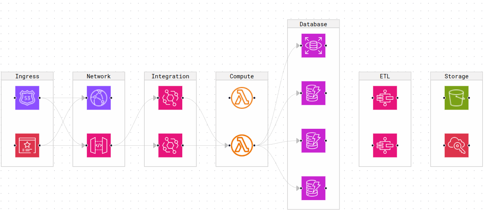

# Introduction

Flowee is a command-line tool that helps you visualize CloudFormation templates as React Flow diagrams. This allows you to quickly
understand the structure, dependencies, and potential issues within your templates.



## Here's how it works:

- **Send your CloudFormation template:** Use the flowee generate-diagram command followed by the path to your template file (e.g., flowee
  generate-diagram --cf template.json).

- **Visualization magic:** Flowee processes the template and generates a React Flow diagram that clearly represents the resources and their
  connections.

- **Explore your diagram:** The diagram opens in your web browser, allowing you to navigate and inspect the different components of your
  CloudFormation template.

## Benefits of using Flowee:

- **Improved understanding:** Visualizing your CloudFormation templates makes them easier to grasp, especially for complex configurations.
- **Early issue detection:** Identify potential errors or inefficiencies within your templates before deployment.
- **Enhanced collaboration:** Share the generated diagrams with your team for better communication and collaboration.


# Installation

## Requirements

- Python version 3 or above (which can be checked by running python --version). If you don't have Python installed, you can download it from
  [here](https://www.python.org/downloads/).
- pip (which comes with Python)
- node version 20 or above
- npm 

## Installation

You can install the package using pip. Run the following command in your terminal:

```bash
pip install flowee
```

This will install the package and its dependencies on your system.

Before using this package, you need to install Playwright and the necessary browsers. You can install Playwright and browsers by running:

```bash
pip install playwright
python -m playwright install
```

For more detailed instructions, please refer to the Playwright documentation: https://playwright.dev/python/docs/intro

## Updating

You can update the package to the last version using pip. Run the following command in your terminal:

```bash
pip install --upgrade flowee
```

This will update the package to the latest version available on PyPI.

# Usage

## Starting Flowee

To start Flowee, run the following command:

```bash
flowee generate-diagram --cf <path-to-your-cloudformation-template> --path <output-directory>
```

This will generate a json file of your CloudFormation template in the specified output directory.

## Options

- `--cf`: The path to your CloudFormation template. Default is `template.json`.
- `--path`: The output directory where the diagram will be saved. Default is the current directory.
- `--name`: The name of the diagram file. Default is `aws-diagram`.